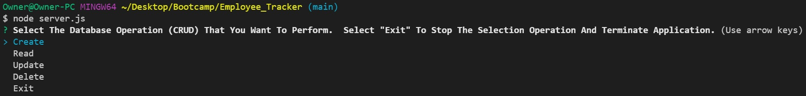
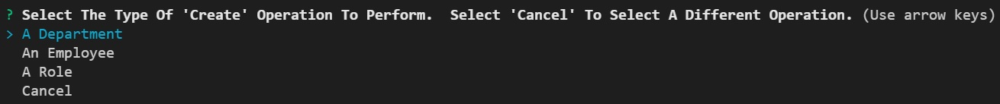
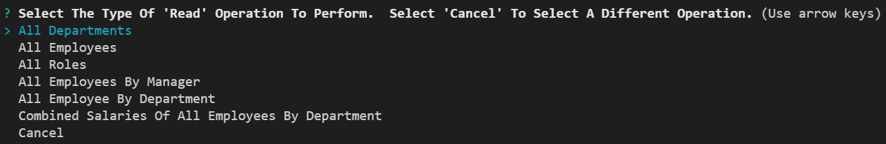
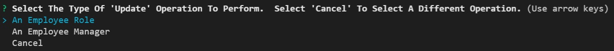
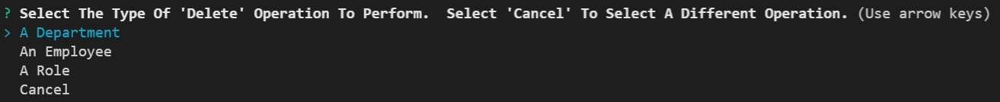
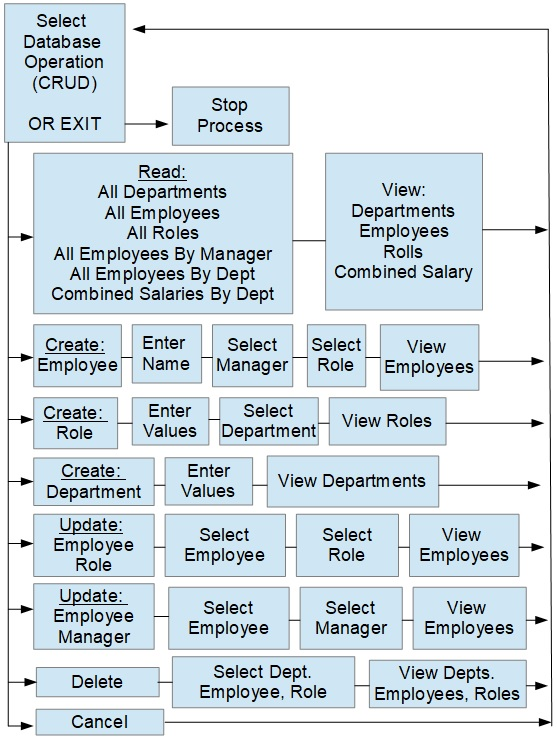

# Employee Tracker

Employee Taker for UNH Boot Camp # 12 SQL assignment. 
This repository was created for the Homework Assignment dealing with SQL.  

Developer: Duane Cantera 
Date: Dec. 9, 2021 
Assignment: #12 - SQL - Employee Taker  

This application is used to manage a company's employee database.  It allows the user to view and
manage the departments, roles and employees.  The user can perform the following operations:
  
View All Departments, Roles or Employees.
 
View Employees By Manager or Department.
 
Add A Department, Role or Employee.
 
Update An Employee Role or Employee Manager.
 
Delete Departments, Roles or Employees.
 
View the Combined Salaries of all Employees for all Departments.
  

### Technologies Used:
Node.js, Inquirer and mysql2
  

#### Mysql2 Design Issue:
For all of my database commands I used Prepared Statements by using the execute() command.  I also used the Promise function on connections.
"db.promise.execute()"
  

#### Displaying Table Data:
I used console.table() commands to display of the table data for this application.
  

### User Interface Design

I first allow the user to select the Database operation (CRUD) that they want to perform or "Exit".
 

  
Then the user can select what Table operation to perform for the Database operation or select "Cancel" to start over:
 
CREATE:

 
A Department - The user enters the Department Name and then all Departments are displayed.
 An Employee - The user enters the First Name, Last Name, Selects the Role and Manager, then all Employees are displayed.
 A Role - The user enters a Title and Salary and selects the Department, then all Roles are displayed.
  
READ:

 
All Departments Displayed - Sorted By Name in Ascending Order.
 All Employees Displayed - Sorted By Last, First Name in Ascending Order.
 All Roles Displayed - Sorted By Title in Ascending Order.
 All Employees By Manager Are Displayed - Sorted by Manager Last, First Name followed by Employee First Last Name in Ascending order.
 All Employees By Department Are Displayed- Sorted By Department, followed by Employee Last, First Name in Ascending order.
 Combined Salaries of All Employees By Department Are Displayed - Sorted by Department Name in Ascending order.
  
UPDATE:

 An Employee Role - Select Employee, Select Rule, then all Employees are displayed.
 An Employee Manager - Select Employee, Select Manager, then all Employees are displayed.
  
DELETE:

 A Department - Select Department, then all Departments are displayed.
 An Employee - Select Employee, then all Employees are displayed.
 A Role - Select Role, then all Roles are displayed.
  
EMPLOYEE MANAGERS:
 If an Employee does not have a Manager the user can select the "None" option when Managers are displayed for selection.
 When Mangers are displayed the Manager Column will contain the text "NONE" if an employee does not have a manager.
  

### CODE LAYOUT AND DESIGN:

  

### LINKS:

Git Hub Link To Code For Project:  
https://github.com/canterad/Employee_Tracker.git
  
Links to walkthrough videos on Google Drive: 
https://drive.google.com/file/d/1YxsFJS4cytlRszdo8rk8r0Ywx-nOufEB/view?usp=sharing

